<h1 align="center">PiaNotes</h1>

[The PiaNotes website](https://alexah88.github.io/pianotes/) has been developed for XXX

<h2 align="center"></h2>

## __User Experience (UX)__

-   ### ***User stories***

    -   #### First Time Visitor Goals

        1. As a First Time Visitor, I want to easily understand the main purpose of the site and learn more about the Horizon games.
        2. As a First Time Visitor, I want to be able to easily be able to navigate throughout the site to find content.
        3. As a First Time Visitor, I want to locate the site creator's social media links to see their following on social media to determine how trusted and known they are.

    -   #### Returning Visitor Goals

        1. As a Returning Visitor, I want to look up the machine catalogue page, to find out how to beat the enemy machines in the game.
        2. As a Returning Visitor, I want to rewatch the YouTube videos on the About The Games page and the Machine Catalogue page, to immerse myself in the Horizon gaming world.
        3. As a Returning Visitor, I want to sign up for the newsletter and join the community.
        4. As a Returning Visitor, I want to get in contact with the site creator with any questions I may have about the site.

    -   #### Frequent User Goals

        1. As a Frequent User, I want to check to see if there are any newly added machines on the machine catalogue, as not all machines in the games are currently included.
        2. As a Frequent User, I want to check to see if there are any new game releases planned.
        3. As a Frequent User, I want to have more interaction with the community.

-   ### ***Design***
    
    -   #### Colour Palette

        - The colour palette is made up of four colours: 
          - Yellow #FFDE59
          - Purple #5E17EB
          - Black #000000
          - White #FFFFFF

        - The yellow #FFDE59 and purple #5E17EB were chosen for their playfulness, fiting with the theme of the site, all the while taking into account their compatibility with each other and the site as a whole. Black #000000 and white #FFFFFF are used as the third and fourth colours on the site as neutral tones.

    -   #### Typography
        - The [Orelega One](https://fonts.google.com/specimen/Orelega+One?query=orelega) and [Poppins](https://fonts.google.com/specimen/Poppins?query=poppins) fonts are used across the site, with 'Orelega One' used for the headings and 'Poppins' used for the remaining text. 

        - The fonts were chosen for their playful feel, taking into account the theme of the site. 
    
    -   #### Imagery

        - The piano and computer mouse icons on the Instructions Page were added to avoid having a text-heavy page and to create a playful and fun look and feel. 

-   ### ***Wireframes***
    - The Play and Challenge pages at the wireframe stage were later combined to create one page (Play), with the ability to switch between Freestlye and Challenge modes. This was done in order to improve UX and repetitive code on two pages. 

    -   Play page:
        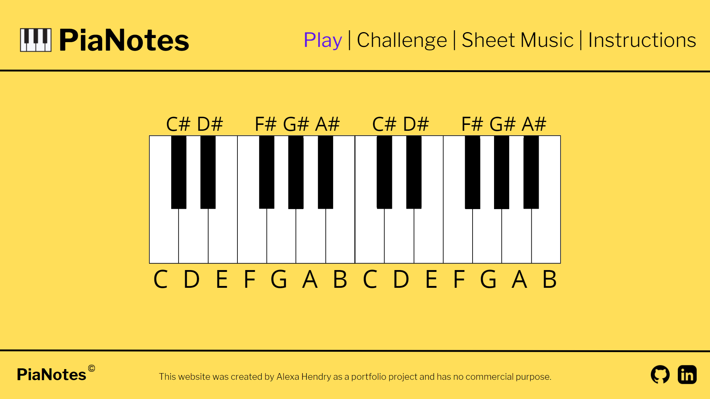

    -   Challenge page:
        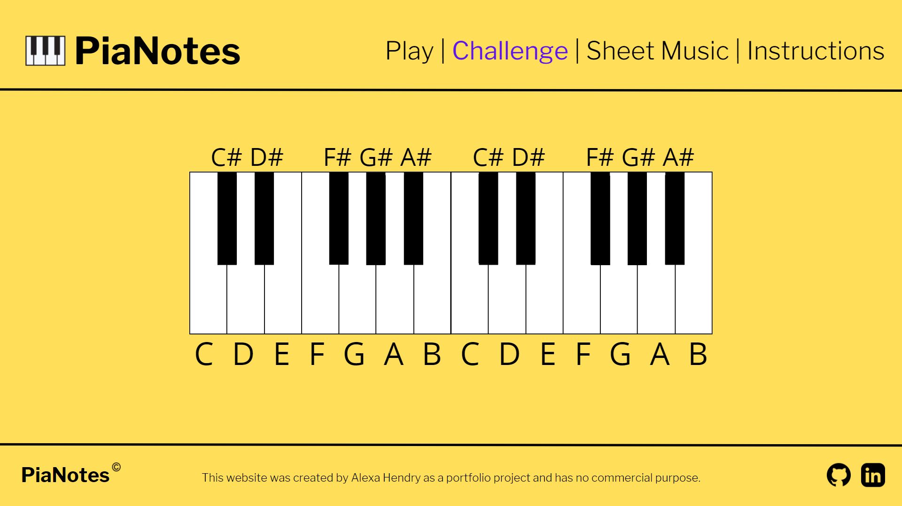

    -   Sheet Music page:
        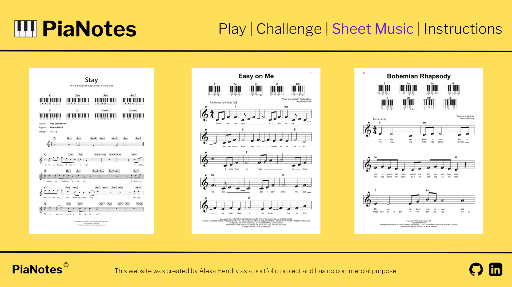
    
    -   Instructions page:
        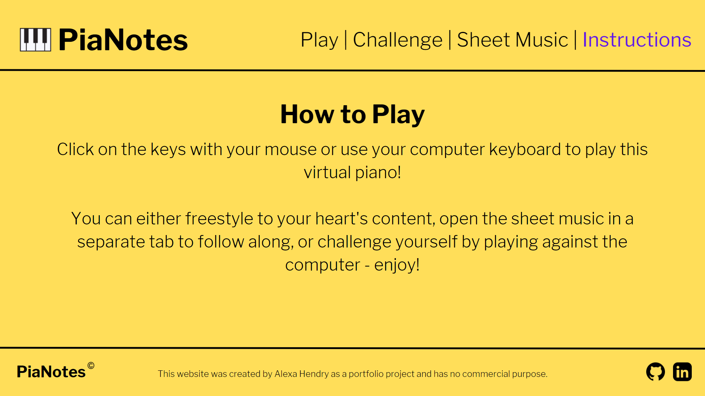

## __Features__

### ***Existing Features***

- #### Navigation Bar

  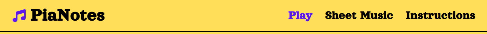

  - The navigation bar includes five clickable links, allowing the user to easily access the four pages on the site: 
    - Horizon GamePedia site name (links to the About The Games home page)
    - About The Games page
    - Game Developer History page
    - Machine Catalogue page
    - Sign Up page

  - In order to make navigation easier for the user, the navigation bar is in a fixed position, meaning that it remains at the top of the page as the user scrolls down.

  - The navigation bar follows the same style and size as the footer, and appears in the same format on all four pages - this allows for consistency throughout the site.

  - A hover effect of the text turning white is included, allowing the user to understand that the link is clickable. Once the link has been clicked, the text remains white to indicate to the user which page they find themselves on. 

  - The navigation bar was created with HTML and CSS only and is fully responsive across devices.
    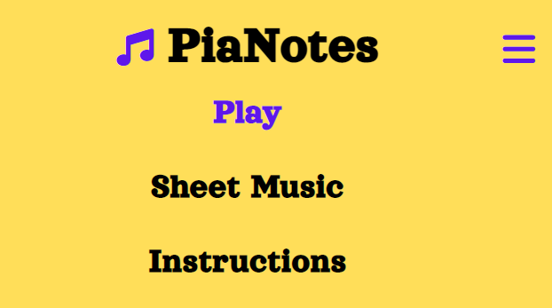

- #### Hero Images

  - Each page has its own hero image to immediately immerse the user into the breath-taking world of the Horizon games - whether it be existing fans of the games or newcomers coming to learn more about the world of Horizon.

    - About The Games Hero Image:
    

    - Game Developer History Hero Image:
    

    - Machine Catalogue Hero Image:
    

    - Sign Up Hero Image:
    

- #### About The Games Page

  

  - The About The Games page is the landing page of the website and as the user's first port of call serves to inform the user about the Horizon games franchise.
  
  - The page is split into three sections:
    - Information about the games in general, detailing what type of gaming experience the player can expect.  
    - A synopsis on the first game release, Zero Dawn, including a video trailer of the game. 
    - A synopsis on the second game release, Forbidden West, including a video trailer of the game.

- #### Game Developer History Page

  

  - The Game Developer History page serves to provide background to the user about who created the games and how they came to exist.

  - The page is split into two sections:
    - A timeline of key dates leading to the creation of the developer of the games, Guerrilla Games.
    - A detailed history of how the game studio, Guerrilla Games, came to be.  

- #### Machine Catalogue Page

  
  
  

  - The Machine Catalogue page allows the user to find out more about the enemy machines in the game, as well as tips on how to beat them in both the first and second intallments of the Horizon games. 

  - The page is split into three sections:
    - Background information on what the machines are in the games and how they were developed. 
    - Videos introducing the user to the different machine types that exist in both games (Zero Dawn and Forbidden West).
    - A catalogue of six machines that appear in both games, including images, machine names, and info on their strenghts, weaknesses and cauldron locations that allow them to be overriden and controlled. This valuable information is helpful to the user to enable them to beat the machines and master the games. 

- #### Sign Up Page

  

  - The Sign Up page encourages the user to join the Horizon gaming community, and to connect with fellow gamers, allowing for social connection. Please note that the community and newsletter are not currently functional on this project and would be implemented in future developments. 

  - The page contains one section, in the shape of a form that covers three areas:
    - User details, including first name, last name and email address.
    - A survey to find out more about the user's profile, and including age, gender, gaming hours, and gaming style. 
    - The option to sign up for the newsletter. 

- #### The Footer

  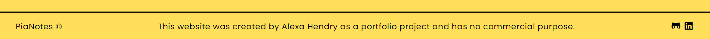

  - The footer follows the same style and size as the navigation bar, and appears in the same format on all four pages - this allows for consistency throughout the site.

  - The footer contains three elements:
    - The copyrighted site name on the left hand side. 
    - Information abou the site and how it was created. 
    - Social media links, allowing the user to visit the site creator's LinkedIn and GitHub pages.

  - The footer was created with HTML and CSS only and is fully responsive across devices.

    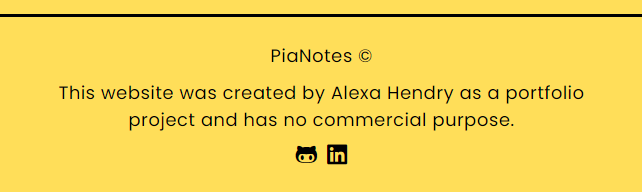

### ***Future Implementations***

- #### General
  
  - Use a [recreation of the in-game font](https://www.fontspace.com/category/horizon-zero-dawn) for headings across the site.

  - Add a Tribe Quiz page with JavaScript, allowing the user to answer questions about their gaming style resulting in being assigned to a tribe from the Horizon universe. 

  - Add a chat room function to the site for users to be able to connect socially. 

  - Improve Lighthouse Performance score on all pages by further compressing image sizes without losing the quality, or by using a next-gen image format such as WebP or AVIF. 

- #### Navigation Bar
  
  - Add sub-menu on navigation bar, linking to the h3 and h4 sections on the site.

  - Make header invisible on smaller viewports and allow for swipe down or hover to make it appear. 

  - Improve the hamburger menu functionality by using a JavaScript version instead. 

- #### Hero Images

  - Add a text box or scroll down arrow on the hero images to make it clearer to users that there is content below the images - as they take up a lot of the screen space in order to be visually striking.  

- #### Machine Catalogue Page

  - Include all the machines from the Horizon games to have the full collection of existing machines. 

  - Make the machine catalogue info text on the images visually more appealing on smaller viewports, for example using a different system instead e.g. modals with Java. 

- #### Sign Up Page

  - Make the newsletter an actual function of the site.

  - Create user profile and login options in order to create a true community where users can connect. 

  - Make the how many hours a day do you play selector into a range slider instead and show the 1-24 hour values with JavaScript. 

- #### The Footer

  - Add a back to top arrow or button to allow the user to get back to the top of the screen easily. 

## __Technologies Used__

### ***Languages Used***

-   [HTML5](https://en.wikipedia.org/wiki/HTML5)

-   [CSS3](https://en.wikipedia.org/wiki/Cascading_Style_Sheets)

-   [JavaScript](https://en.wikipedia.org/wiki/JavaScript)

### ***Frameworks, Libraries & Programs Used***

1. [Google Fonts:](https://fonts.google.com/)
    - Google Fonts was used to import the ''Orelega One' and 'Poppins' fonts into the style.css file which is used on all pages throughout the project. [Orelega One](https://fonts.google.com/specimen/Orelega+One?query=orelega) for the headings and [Poppins](https://fonts.google.com/specimen/Poppins?query=poppins) is used for the remaining text.

1. [Font Awesome:](https://fontawesome.com/)
    - Font Awesome was used on all pages throughout the website to add icons for aesthetic and UX purposes.

1. [Git:](https://git-scm.com/)
    - Git was used for version control by utilizing the Gitpod terminal to commit to Git and Push to GitHub.

1. [GitHub:](https://github.com/)
    - GitHub is used to store the projects code after being pushed from Git.

1. [Canva:](https://www.canva.com/)
    - Canva was used to create the wireframes during the design process.

1. [Chrome DevTools:](https://developer.chrome.com/docs/devtools/)
    - Chrome DevTools was used to consistently check the site in terms of responsivity, performance, accessibility, best practice and SEO.

1. [Font Awesome Favicon Generator:](https://gauger.io/fonticon/)
    - Font Awesome Favicon Generator was used to reproduce a favicon version of the [Font Awesome Music Icon](https://fontawesome.com/icons/music?s=solid) used in the header site name.

1. [Responsinator:](https://www.responsinator.com/)
    - Responsinator was used to check responsivity across all devices.

## __Testing__

### ***HTML and CSS Testing***

-   [W3C Markup Validator](https://jigsaw.w3.org/css-validator/#validate_by_input) was used to validate every page of the project to ensure there were no HTML syntax errors in the project.
    - [Results index.html](assets/testing/testing-html-index.pdf)
    - [Results game-developer-history.html](assets/testing/testing-html-game-developer-history.pdf)
    - [Results machine-catalogue.html](assets/testing/testing-html-machine-catalogue.pdf)
    - [Results sign-up.html](assets/testing/testing-html-sign-up.pdf)

-   [W3C CSS Validator](https://jigsaw.w3.org/css-validator/#validate_by_input) was used to validate every page of the project to ensure there were no CSS syntax errors in the project.
    - [Results style.css](assets/testing/testing-style-css.pdf)

### ***Performance, Accessibility, Best Practices, and SEO Testing***

  [Chrome DevTools Lighthouse](https://developers.google.com/web/tools/lighthouse) was used to test Performance, Accessibility, Best Practices and SEO. All tests performed in the 90-100 green score, except for in the Performance category on some pages that came in the yellow range. Compressing the image size resulted in pixelated images and was therefore dismissed and a lower performance rating accepted. 
  - The About The Games Page scored 77 on mobile.
  - The Game Developer History Page scored 65 on mobile.
  - The Sign Up Page scored 80 on mobile and 84 on desktop.

- #### Desktop Testing with [Chrome DevTools Lighthouse](https://developers.google.com/web/tools/lighthouse)
  - [About The Games Page](assets/testing/testing-lighthouse-index-desktop.pdf)
  - [Game Developer History Page](assets/testing/testing-lighthouse-developer-history-desktop.pdf)
  - [Machine Catalogue Page](assets/testing/testing-lighthouse-machine-catalogue-desktop.pdf)
  - [Sign Up Page](assets/testing/testing-lighthouse-sign-up-desktop.pdf)

- #### Mobile Testing with [Chrome DevTools Lighthouse](https://developers.google.com/web/tools/lighthouse)
  - [About The Games Page](assets/testing/testing-lighthouse-index-mobile.pdf)
  - [Game Developer History Page](assets/testing/testing-lighthouse-developer-history-mobile.pdf)
  - [Machine Catalogue Page](assets/testing/testing-lighthouse-machine-catalogue-mobile.pdf)
  - [Sign Up Page](assets/testing/testing-lighthouse-sign-up-mobile.pdf)

- #### Further Accessibility Testing

  - [EightShapes Contrast Grid](http://eightshapes.com/) was used to test the colour palette of the site for any accessibility issues. Only AAA and AA rating options were used on the site. 
  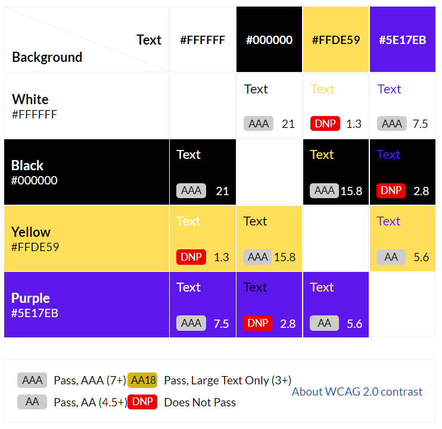
  
  - Any icons on the site that are for decorative purposes only use the aria-hidden="true" attribute to accommodate for accessibility, as recommended by [Font Awesome's Accessiblity Page           (https://fontawesome.com/v5/docs/web/other-topics/accessibility)
  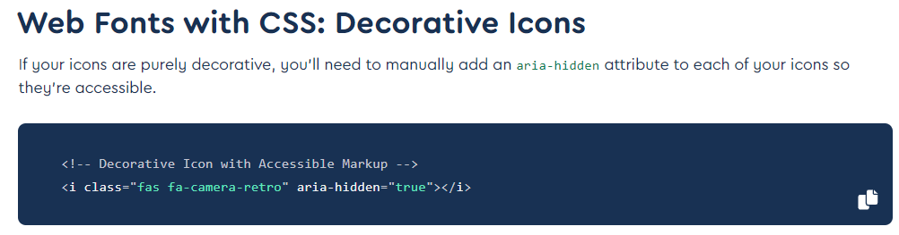

### ***Responsive Testing***

  - [Chrome DevTools](https://developer.chrome.com/docs/devtools/) and [Responsinator](https://www.responsinator.com/) were used to regularly check for any responsive design issues. Rather than only checking for specific device screen widths, I used DevTools to reduce the viewport width gradually and noted any and all issues for each width. My media queries are based on these specific pixel widths rather than typical viewport breakpoints to allow for an enjoyable experience for all users, on any devices they use. 

  - The site is responsive down to 320px viewport widths, and in most cases even down to 280px.  

### ***Testing User Stories from User Experience (UX) Section***

-   #### First Time Visitor Goals

    1. As a First Time Visitor, I want to easily understand the main purpose of the site and learn more about the Horizon games.

        1. Upon entering the site, users are automatically greeted with a clean and easily readable navigation bar to go to the page of their choice. Underneath there is a Hero Image and upon scrolling down the user discovers the main section of the page.
        2. The main points are made immediately clear with the hero image. It serves to introduce the user to the world of Horizon if they don't know the games, or to plunge the user back into this world as if they were playing the games.  
        3. The user has the option to scroll down, which will lead to the main page content, allowing them to learn more about the Horizon games.  

    2. As a First Time Visitor, I want to be able to easily be able to navigate throughout the site to find content.

        1. The site has been designed to be fluid and never to entrap the user. At the top of each page there is a clean navigation bar, each link clearly describes what page they will end up on. There is also a visual aid in the form of colours to help the user understand which page they are on: white for the current page, light blue for the other pages they can click on to visit. 
        2. The navigation bar is in the fixed position and thus stays at the top of the page as the user navigates the site, allowing the user to easily switch between pages and get back to the top of the page again by clicking on the page link they are currently on. 
        3. On smaller viewports the navigation bar remains fixed, but is reduced in size as to not take up too much space, and includes the site name only, which remains clickable. In order to access the other site pages there is a hamburger bar to the left of the site name, which pops out onto the screen and disappears again once the desired page has been selected. 
        4. On the Sign Up Page, after a form response is submitted, the user is notified that the form has been successfully sent.

    3. As a First Time Visitor, I want to locate the site creator's social media links to see their following on social media to determine how trusted and known they are.
        
        1. The user can scroll to the bottom of any page on the site to locate social media links in the footer.

-   #### Returning Visitor Goals

    1. As a Returning Visitor, I want to look up the machine catalogue page, to find out how to beat the enemy machines in the game.

        1. The navigation bar clearly highlights the "Machine Catalogue" Page.
        2. The user will be directed to the page with another hero image and the machine catalogue in the main page area below.
        3. The Beat The Machines section explains to the user that they need to hover over (or tap on touchscreens) the machine images below in order for the info text to appear, which details how they can override and destroy the machines. 

    2. As a Returning Visitor, I want to rewatch the YouTube videos on the About The Games page and the Machine Catalogue page, to immerse myself in the Horizon gaming world.
        
        1. The navigation bar clearly highlights the "About The Games" and "Machine Catalogue" Pages.
        2. The videos do not autoplay and it is up to the user to press the play button, making it a chosen action. 
        3. The videos can either be played on the site directly with a set window size, or they can be made full-screen - depending on what the user prefers. 

    3. As a Returning Visitor, I want to sign up for the newsletter and join the community.
        
        1. The navigation bar clearly highlights the "Sign Up" Page.
        2. The form on the sign up page is clear in its instruction, detailing three sections to complete: user details, survey questions, and newsletter subscription. 
        3. Once complete the user is instructed to click the "Join Us!" button and once clicked is informed that the form has successfully been submitted.

    4. As a Returning Visitor, I want to get in contact with the site creator with any questions I may have about the site.
        
        1. The footer contains links to the site creator's GitHub and Linkedin pages.
        2. Whichever link they click, it will be open up in a new tab to ensure the user can easily get back to the website.

-   #### Frequent User Goals

    1. As a Frequent User, I want to check to see if there are any newly added machines on the machine catalogue, as not all machines in the games are currently included.

        1. The user would already be comfortable with the website layout and can easily find the "Machine Catalogue" Page in the navigation bar.
        2. Here they would quickly see if any new machines had been added to the list. 

    2. As a Frequent User, I want to check to see if there are any new game releases planned.

        1. The user would already be comfortable with the website layout and can easily find the "About The Games" or "Game Developer History" Pages in the navigation bar. 
        2. Here they would find updates on any new game news. 

    3. As a Frequent User, I want to have more interaction with the community.
        
        1. The user would already be comfortable with the website layout and can easily find the "Sign Up" Page in the navigation bar.
        2. Here they would find updates on any developments within the community, such as a user creation and login section, or a chat function between users.  

### ***Further Testing***

-   The Website was tested on Google Chrome, Firefox, and Microsoft Edge browsers.

-   The website was viewed on a variety of devices such as Desktop up to 28 inch screen with 4k resolution, Laptop, Pixel 3a, Pixel 4, Samsung Galaxy Tab S5e.

-   A large amount of testing was done to ensure that all pages were linking correctly.

-   Friends and family members were asked to review the site and documentation to point out any bugs and/or user experience issues.

### ***Fixed Bugs***

- Initially `style.backgroundColor` was used on the Challenge mode of the piano to achieve a purple coloured piano key as it was played - see example `function twenty()` below. This was followed by a `clearKeyLights function`, resetting the `style.backgroundColor` to white and black respectively - see `function clearKeyLights` below. This however caused a bug when switching to Freestyle mode after having played Challenge mode: the purple colour no longer appeared when playing the notes. This was due to the `style.backgroundColor` taking precedence over the `.active` class used on Freestyle mode. The bug was fixed by applying an `.active` class on the Challenge as well - see `function nineteen()` example below. 
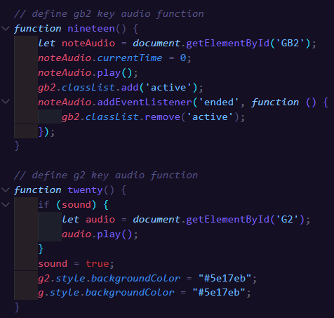
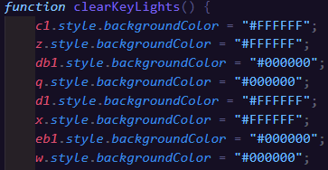

### ***Known Bugs***

-   XXX

## __Deployment__

### ***GitHub Pages***

The project was deployed to GitHub Pages using the following steps:

1. Log in to GitHub and locate the [PiaNotes GitHub Repository](https://github.com/AlexaH88/pianotes)
2. At the top of the Repository (not top of page), locate the "Settings" Button on the menu.
    - Alternatively Click [Here](https://raw.githubusercontent.com/) for a GIF demonstrating the process starting from Step 2.
3. Scroll down the Settings page until you locate the "GitHub Pages" Section.
4. Under "Source", click the dropdown called "None" and select "Master Branch".
5. The page will automatically refresh.
6. Scroll back down through the page to locate the now published site [link](https://alexah88.github.io/pianotes/) in the "GitHub Pages" section.

### ***Forking the GitHub Repository***

By forking the GitHub Repository we make a copy of the original repository on our GitHub account to view and/or make changes without affecting the original repository by using the following steps:

1. Log in to GitHub and locate the [PiaNotes GitHub Repository](https://github.com/AlexaH88/pianotes)
2. At the top of the Repository (not top of page) just above the "Settings" Button on the menu, locate the "Fork" Button.
3. You should now have a copy of the original repository in your GitHub account.

### ***Making a Local Clone***

1. Log in to GitHub and locate the [PiaNotes GitHub Repository](https://github.com/AlexaH88/pianotes)
2. Under the repository name, click "Clone or download".
3. To clone the repository using HTTPS, under "Clone with HTTPS", copy the link.
4. Open Git Bash
5. Change the current working directory to the location where you want the cloned directory to be made.
6. Type `git clone`, and then paste the URL you copied in Step 3.

```
$ git clone https://github.com/AlexaH88/pianotes
```

7. Press Enter. Your local clone will be created.

```
$ git clone https://github.com/AlexaH88/pianotes
> Cloning into `CI-Clone`...
> remote: Counting objects: 10, done.
> remote: Compressing objects: 100% (8/8), done.
> remove: Total 10 (delta 1), reused 10 (delta 1)
> Unpacking objects: 100% (10/10), done.
```

Click [Here](https://help.github.com/en/github/creating-cloning-and-archiving-repositories/cloning-a-repository#cloning-a-repository-to-github-desktop) to retrieve pictures for some of the buttons and more detailed explanations of the above process.

## __Credits__

### ***Code***

- The following were used as references to help with writing the HTML, CSS and JavaScript code:
  - [Code Institute LMS](https://learn.codeinstitute.net/ci_program/diplomainsoftwaredevelopmentecommerce), in particular the [CI Love Maths Walkthrough](https://learn.codeinstitute.net/courses/course-v1:CodeInstitute+LM101+2021_T1/courseware/2d651bf3f23e48aeb9b9218871912b2e/78f3c10a937c4fe09640c7c0098d16bd/)
  - [W3Schools](https://www.w3schools.com/) 
  - [Stack Overflow](https://stackoverflow.com/)
  - [MDN Web Docs](https://developer.mozilla.org/en-US/)

- The virtual piano code was taken from [Web Dev Simplified's](https://www.youtube.com/channel/UCFbNIlppjAuEX4znoulh0Cw) [Build A Piano With JavaScript Tutorial](https://www.youtube.com/watch?v=vjco5yKZpU8) and adapted. 

- The game challenge code was taken from [Free Code Camp Org's](https://www.youtube.com/channel/UC8butISFwT-Wl7EV0hUK0BQ) [Simon Game JavaScript Tutorial for Beginners](https://www.youtube.com/watch?v=n_ec3eowFLQ) and adapted. 

- The CSS flexbox code was taken from [Stack Overflow](https://stackoverflow.com/), specifically from [this thread](https://stackoverflow.com/questions/643879/css-to-make-html-page-footer-stay-at-bottom-of-the-page-with-a-minimum-height-b).

- The code to use icons as list bullet points on the Instructions page was taken from [Font Awesome](https://fontawesome.com/), specifically [this page](https://fontawesome.com/docs/web/style/lists).

- The favicon code was taken from [W3Schools](https://www.w3schools.com/), specifically from [HTML Favicon](https://www.w3schools.com/html/html_favicon.asp) and adapted.

### ***Content***

- All text content was written by the site creator [Alexa Hendry](https://github.com/AlexaH88). 

### ***Media***

- The [piano graphic](https://www.canva.com/media/MAEYJcyVjO8) on the Instructions page was taken from graphic designer [vectortradition](https://www.canva.com/p/vectortradition/) via [Canva](https://www.canva.com/).

- The [mouse graphic](https://www.canva.com/media/MADHSKVmqUU) on the Instructions page was taken from graphic designer [BellafishPh](https://www.canva.cn/p/hnh-nh-ca-bellafish-ph/) via [Canva](https://www.canva.com/).

- The sheet music and corresponding audio on the Sheet Music page was taken from [Musescore](https://musescore.com/) with the individual songs credited as follows:
  - [The Entertainer - Scott Joplin](https://musescore.com/user/167019/scores/162108) by [rui.c.sousa.3](https://musescore.com/user/167019)
  - [Für Elise - Ludwig van Beethoven](https://musescore.com/user/19710/scores/33816) by [ClassicMan](https://musescore.com/classicman)
  - [Clair de Lune - Claude Debussy](https://musescore.com/user/19710/scores/58553) by [ClassicMan](https://musescore.com/classicman)
  - [Canon in D - Johann Pachelbel](https://musescore.com/user/1809056/scores/1019991) by [lemontart](https://musescore.com/user/1809056)
  - [Dance of the Sugar Plum Fairy - Pyotr Ilyich Tchaikovsky](https://musescore.com/user/3435661/scores/2899321) by [Nohpets](https://musescore.com/user/3435661)
  - [Happy Birthday - Patty & Mildred J. Hill](https://musescore.com/user/173585/scores/166951) by [wildpig](https://musescore.com/user/173585)

- The piano notes audio was recorded by the site creator [Alexa Hendry](https://github.com/AlexaH88) on [Ableton Live](https://www.ableton.com/en/live/) with the [Grand Piano](https://www.ableton.com/en/packs/grand-piano/) sound. 

### ***Acknowledgements***

Massive thanks to: 

- My mentor, [Darío Carrasquel](https://github.com/jeetkunecoder), for guiding me and giving me helpful feedback and advice. 

- My fellow Code Institute students and friends for their help, generous feedback, and incredible knowledge:
  - [Emanuel Silva](https://github.com/manni8436)
  - [Abi Harrison](https://github.com/Abibubble)
  - [Suzy Bennett](https://github.com/suzybee1987)
  - [Natalie Kate Alexander](https://github.com/natalie-kate)
  - [Dave Horrocks](https://github.com/DaveyJH)

- Tutor Support, Student Care and the Slack Community at [Code Institute](https://codeinstitute.net/global/) for their support.

- And last but not least, my fiancé [Antoine Masson](https://www.linkedin.com/in/antoine-masson-55b65094/) for helping me through the stressful moments and for supporting us financially while I make this big career change. 